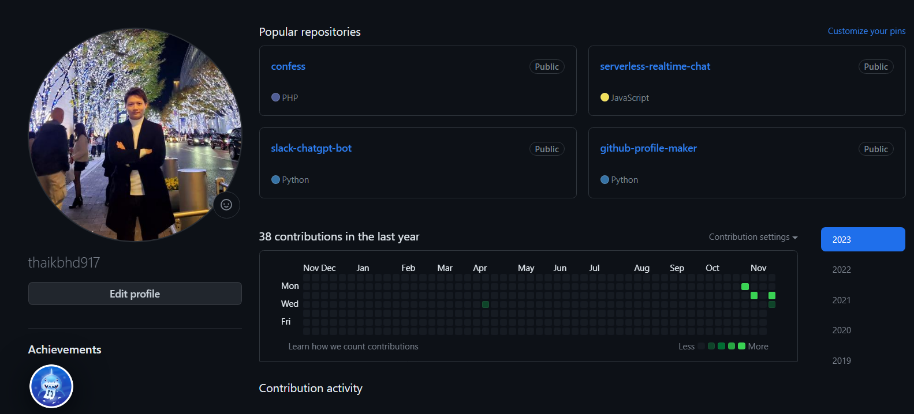
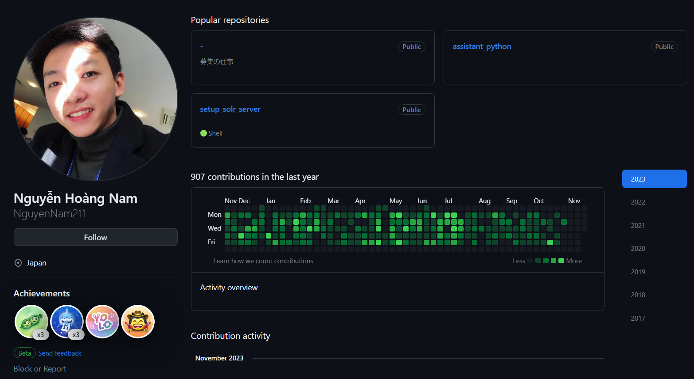

# GitHub Contribution Automator

## Overview

The GitHub Contribution Automator is a tool designed to automate the process of creating fake GitHub profile contributions. Leveraging AWS Scheduler and Lambda functions, this tool enables users to schedule automatic commits, create GitHub pull requests (PRs), review PRs, and merge PRs. It's important to note that the primary purpose of this tool is for educational and experimental use only, and it should not be used to deceive or manipulate actual open-source contributions.

FROM THIS

TO THIS


## Features
 - Automatic Committing: Schedule regular commits to specific repositories to simulate ongoing development activity.
 - PR Creation: Automatically create pull requests on targeted repositories.
 - PR Review: Simulate the review process by automatically providing reviews to the created pull requests.
 - PR Merging: Automate the merging of pull requests to contribute to the commit history.
Prerequisites

Before using this tool, ensure you have the following:

- AWS account/IAM user with permissions to create Lambda functions, CloudWatch Events, S3 and IAM role.
- GitHub account with repositories to contribute to.
- AWS CLI & AWS SAM
- Python 3.10

## SETUP
1. Install AWS SAM and config AWS credentials
2. Change github credential in samconfig_sample.yml
3. Build project
```sam build --config-file samconfig_sample.yml```
4. Deploy project to aws
```sam deploy --config-file samconfig_sample.yml --guided```

# Important Notes
- This tool is intended for educational and experimental purposes only.
- Use it responsibly and ethically, avoiding any deceptive or manipulative practices.
- Be aware of GitHub policies and terms of service to ensure compliance.

# Contribution 
Contributions to this project are welcome. If you encounter issues or have ideas for improvements, feel free to open an issue or submit a pull request.